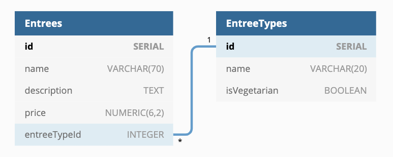
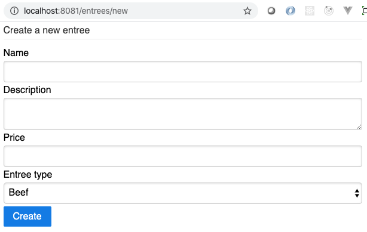
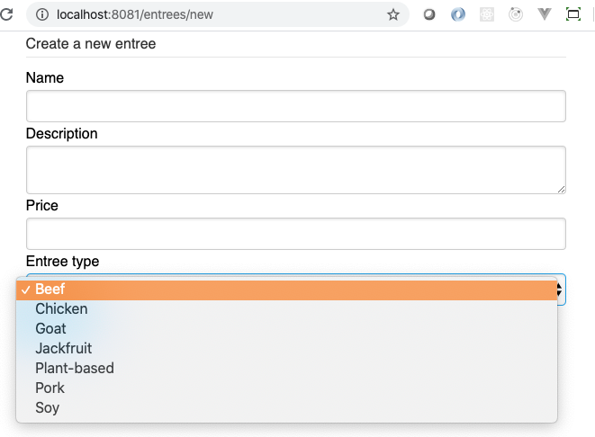
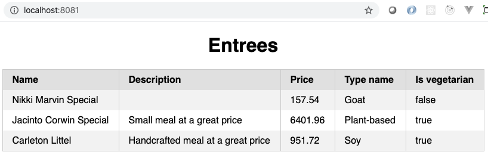

# Express Application Assessment

**Note:** To read this in a rendered view, open your VS Code Command Palette
(using Control+Shift+P on Windows, Command+Shift+P on macOS) and choose
"Markdown: Open Preview" or "Markdown: Open Preview to Side".

In this assessment, you are asked to create an Express application. You will
create an Express application that

* Has a page that shows a list of entrees
* Has a page that allows you to add an entree
* Is protected from Cross-Site Request Forgeries

In the **documentation** directory, you will find

* A picture of the data model
* A screenshot of the entree listing page
* A screenshot of the entree creation form

The screenshots show you what is expected from a _structure_ standpoint. They
are meant to be guides. The tests will _not_ make any assertions about the
styling of your pages, merely the structure of the pages and the data presented
on them.

Use the technologies you have used up to this point. They are all installed in
the **package.json** for your convenience.

* Express.js
* pg (the library to connect to PostgreSQL), Sequelize, and Sequelize CLI
* CSURF middleware
* Pug.js
* cookie-parser middleware
* body-parser middleware
* nodemon (for development purposes)

A **package.json** file already exists with the dependencies. Please run `npm
install` to install those before doing your development and running your tests.
Do not remove any dependencies already listed in the **package.json**.

## Getting started

Download the repository from
https://github.com/appacademy/assessment-express-application-a.

Run `npm install` to install the dependencies listed in the last section.

## Running the application

You can run your application in "dev" mode. The **nodemon** package is installed
and runnable from `npm run dev`.

## Running the tests

This is "black-box testing". The tests will _only_ use your Express application.
It will not make connections to the database or directly test your route
handlers. They will merely make HTTP requests of your Express app and analyze
the responses.

To ease your development, tests will run against your **development** database
and _not_ the test database.

**You** will be responsible for creating, migrating, and seeding the data in
your development database.

Run your tests with `npm test`.

If you get tired of seeing all of the Sequelize failures, you can try running
`npm test 2> /dev/null` which should redirect the annoying messages into
oblivion but leave the mocha output available for you to read. This may prevent
you from seeing other errors, though, so make sure to run it without the
`2> /dev/null` if you're trying to get a test to pass and need to see error
output.

## App Requirements

These are the requirements for the application. Follow them closely. The tests
will attempt to read data from your rendered HTML. The tests will **not** make
any connections to your database. However, the name of the login, the login
password, and the database are provided for you so that instructors can easily
run your code, if need be.

Read all of the requirements. Determine the data needed to include in your data
model.

Please use port 8081 for your Express.js server.

### The database

* The login name that you must use is "express_assessment_app"
* The login password that you must use is "3GsLEDYhcCi4WJ8y"
* Your user must have the CREATEDB privilege so that you can run
  `npx sequelize-cli db:create`
* The database prefix for your databases must be "express_assessment" so that
  you will have in your Sequelize config file:
  * "express_assessment_development"
  * "express_assessment_test" (won't be used by the tests)
  * "express_assessment_production" (won't be used by the tests)

### The data model

Here is a picture of the data model used in this assessment.



You will need to store "entree" data and "entree type" data. The entree type
data should have the following definition.

| Attribute name | Attribute type              | Constraints          |
|----------------|-----------------------------|----------------------|
| name           | Up to 20 characters of text | unique, not nullable |
| isVegetarian   | Boolean                     | not nullable         |


The entree data should have the following definition.

| Attribute name | Attribute type                                | Constraints                              |
|----------------|-----------------------------------------------|------------------------------------------|
| name           | strings up to 70 characters in length         | unique, not nullable                     |
| description    | text of any length                            |                                          |
| price          | NUMERIC(6, 2) to support numbers like XXXX.XX | not nullable                             |
| entreeTypeId   | integer                                       | not nullable, references the entree type |

Moreover, the entree types data must have the following pre-defined data in it

| name        | isVegetarian |
|-------------|--------------|
| Beef        | False        |
| Chicken     | False        |
| Goat        | False        |
| Jackfruit   | True         |
| Plant-based | True         |
| Pork        | False        |
| Soy         | True         |

If you use Sequelize CLI seeders, don't forget to add the entry:

```
"seederStorage": "sequelize"
```

to the config.json so that it will track your seed files and not run them too
many times.

**NOTE:** All of the data constraints for this assessment can be handled by the
database with the `allowNull` and `unique` flags in your migrations. You **do
not** need to use form validations in this project. They are good to have, in
real applications, but can require too much time for you to integrate them into
this project. Again, you **do not** need to use a form validator, just use
database constraints and let the errors turn into 500 status codes by Express.

After you've generated your models, migrations, and seeder files, don't forget
to migrate and seed your database with the appropriate Sequelize CLI commands.

### Your main file

You must use the **app.js** file to create and configure your Express
application. You must store the instance of your Express.js application in a
variable named "app". That is what is exported at the bottom of the **app.js**
file.

Set up your CSRF middleware to use cookies.

### The route "GET /entrees/new"

This page shows a form in which a person can add a new entree. The form must
have

* a method of "post"
* an action of "/entrees"

In the form, you should have these inputs with the provided names:

| Field HTML name | Field type       | Constraints | Default values                             |
|-----------------|------------------|-------------|--------------------------------------------|
| name            | single-line text | required    |                                            |
| description     | multi-line text  |             |                                            |
| price           | number           | required    |                                            |
| entreeTypeId    | dropdown         | required    | One of the pre-defined entree type names   |
| _csrf           | hidden           |             | The value provided by the CSURF middleware |

You should also have a submit button.

Please refer to the screenshots.




### The route "POST /entrees"

The post handler should validate the data from the HTTP request. If everything
is fine, then it should create a new entree and redirect to the route "/".
Remember, all of the data constraints for this assessment can be handled by the
database with the `allowNull` and `unique` flags in your migrations. You **do
not** need to use form validations in this project. They are good to have, in
real applications, but can require too much time for you to integrate them into
this project. Again, you **do not** need to use a form validator, just use
database constraints and let the errors turn into 500 status codes by Express.

If the data does not pass validation, then no new record should be created. It
is ok to just let Express return an error code of 500 in this case. **Note**:
you would not do this in a real application.

### The route "GET /"

When someone accesses your application, they should see a the entrees that
are stored in your database. The details should contain:

* The entree name
* The description of the entree
* The price of the entree
* The name of the entree type
* Whether or not the entree is vegetarian

These must be presented in a table. For example, if someone were to create the
entree "John's Impossible Burger" with a description "Plant-based yumminess on a
bun with brown-ale mustard." and a price of "10.34" and the entree type of
"Plant-based", you should present it like this.



To create a table in a Pug.js template, you'll use something like the following
code. You probably already know this, but it's included for your reference.

```pug
table
  thead
    tr
      th Header 1
      th Header 2
  tbody
    each thing in things
      tr
        td= thing.property1
        td= thing.property2
```

The tests will use a regular expression to determine if each piece of data is
wrapped with TD tags. For example, to test for the "John's Impossible Burger"
value appearing in the HTML of the page, the tests would use the following
regular expression.

```
<td[^>]*>\s*John's Impossible Burger\s*</td>
```

The regular expression will ignore any attributes that you put on the table data
tag as well as any white space around the entry for the data value.

Again, the styling is not important to the tests.
